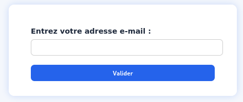

# Writeup - Root or Nothing

## 1 - Challenge Description

**Challenge Namer**: Root or Nothing

**Level**: Medium

This is a **Boot to Root** challenge where the main objective is to fully compromise a target machine, starting from a vulnerable web interface to gaining root privileges on the server.

The difficulty level is **medium**. The challenge requires solid knowledge of common web vulnerabilities , exploitation techniques, and privilege escalation on Linux systems.

**Hint 1** : CVE for Local Privilege Escalation
**Hint 2** : Good Luck for OSINT

----------------------------------------------------------------------

## Get The image from Docker
The challenge image is available both on Docker Hub and on my GitHub.
Here are the links:

- Dockerhub : https://hub.docker.com/repositories/razafindraibe
- Github :httpdsdsdd...

**Download the Docker image from Docker Hub**

<pre> sudo docker pull razafindraibe/challengev2:latest</pre>

**Run a container**
<pre>docker run -d --name challengev2 -p 2222:22 -p 80:5000 razafindraibe/challengev2:latest</pre>

**Check your container’s IP address**

<pre>docker inspect -f '{{range .NetworkSettings.Networks}}{{.IPAddress}}{{end}}' ID DU CONTENEUR </pre>

So, if you forgot your container’s ID, run:

<pre>docker ps</pre>

You will get an output similar to this, then, simply copy the ID.

Here, I have **172.12.0.2**, which is the IP address of our target.

## 3 - Step 1: Reconnaissance and Web Exploitation

Let’s start with a simple IP scan using : **nmap**

We can clearly see that two common ports are open:
- le Port 22 : SSH
- port 5000 : HTTP

**Let’s continue our exploration with** *gobuster*

You can test every page.

**Let’s check what’s on the website** *http://172.17.0.2:5000*

Apparently, it’s an employee management website.
The goal is to exploit this website to steal important information, but before that, we need to go through the login page.

Oh no! We don’t even have credentials to log in.

## Step 2 : OSINT and Site Behavior Analysis

To log in, you need an email and a password.

I don’t know if you noticed, but in the footer (contact section), there are some email addresses.

Now I need passwords ! But where can I find them ?

I tried brute force attacks, **but no luck.**

I noticed that the company’s email format is *firstname+lastname@companydomain.com.*

<pre>EX : darlenalderson@evilcorp.com</pre>

Here are the names of some employees we have here :

The site is an employee management system. Hmmm... We might have a lead since we know the name of the **HR manager: Tyrell Wellick.**
Logically, he should have at least some level of access to the site, given that he is the HR Manager

<pre>
darlenalderson@evilcorp.com
phillipeprice@evilcorp.com
gideongoddard@evilcorp.com
tyrellwellick@evilcorp.com
mrrobot@evilcorp.com
elliotalderson@evilcorp.com
</pre>

But we still don’t have the password.

**Let’s analyze the site’s behavior**

- You can inspect the source code, but nothing interesting comes up.

- You can use Burp Suite or other tools, but again, nothing noteworthy.

I checked the **"Forgot Password"** section and the site offers us two authentication methods:

*a- The email recovery method is not an option since we don’t have access to our victim’s email account.*

*b- Let’s focus instead on the security questions*

We are asked for emails, so it’s time to test the ones we listed earlier:

I tested all the emails, and guess what? 

Our intuition was correct: **only the HR Manager’s email works.**

**Great! We have our entry point, but first, we need to answer these questions.**.

To do that, let’s see if our friend, the HR Manager, has any publicly available information. Let’s OSSSIIINNTTT!

Get your browsers ready to find the possible answers.

After your intensive research, you should be able to find these answers.

**Bingo!!! Well done, hacker!**
Change the password and log in using the *tyrellwellick* email and *the new password*

**Let’s log in now.**

We now have access to the site. Let’s quickly look for anything important that could give us control over the server before the SOC catches us.

## Step 2: Gathered Information and Gaining Access to the Server
*a- Try to visit all the pages.*

*b- To make searching for an employee easier, we can use the search function directly.*

I searched, but nothing was very useful.

**Hint 2 :** The search function is necessarily connected to a database to store user information

I wanted to test something and, surprisingly, it worked. Here’s what I did:

Wow, incredible but true: the site is vulnerable to SSTI.

**What is SSTI?**

**Server-Side Template Injection (SSTI)** is a web vulnerability that happens when ***user input is inserted directly into a server-side template without proper validation or escaping.

Templates are used by web frameworks *(like Jinja2 in Python, Twig in PHP, etc.)* to combine data with HTML pages. If an attacker can inject malicious template code, the server will process it, **allowing them to read sensitive data, run commands, or even take full control of the system.**

If you look online for SSTI payloads, or even ask ChatGPT, it will surely provide some :

**For Listing :**

on Windows :

<pre>{{ request.application.__globals__.__builtins__.__import__('os').popen('dir').read() }}</pre>

on Linux :

<pre>{{ request.application.__globals__.__builtins__.__import__('os').popen('ls').read() }}</pre>

Wow, here we have several files that will be useful to us.

**Let's try to open them**

on Windows :

<pre>{{ request.application.__globals__.__builtins__.__import__('os').popen('type le_nom_du_fichier').read() }}</pre>

on Linux :

<pre>{{ request.application.__globals__.__builtins__.__import__('os').popen('cat le_nom_du_fichier').read() }}</pre>

*a-  Several of them are inaccessible, such as: Dockerfile, docker-compose.yaml, app.py, etc ...*

b- Except for:
- *flag.txt*

Oops, it’s a fake flag, so the battle is not over yet!

- *credentials.txt* :

Hmmmm... I think we have our credentials to access the server, if we manage to decrypt them, of course.

**It’s time to use our friend CyberChef**

The password appears to be encoded in base64.

But it’s still encoded; we just need to identify the type of encoding used.

Our Tyrell encoded it twice… Hmmm, clever (Base64 + Hex).

We finally have our SSH password:

<pre>tyrellwellick:@reyou1or0?</pre>

## Step3 : Privilege Escalation

*We connect via SSH with :*

<pre> ssh tyrellwellick@172.12.0.2 </pre>

*b- Bingo , now we have access to the server*

*c- Let's Search for the userflag:*

*d- Now, let’s try to escalate our privileges.*

Let’s check what’s in the sudoers file:

Only **nano** is allowed, so there’s not much we can do with that.

    Note: In the description, there is a hint about a CVE related to a local privilege escalation.

Seach on interet :

There are several results, but a recent CVE, 2025-32463, caught my attention. So, I looked into it :

**What is this CVE-2025-32463 ?**

**Description**

-  A flaw was found in Sudo. This flaw allows a local attacker to escalate their privileges by tricking Sudo into loading an arbitrary shared library using the user-specified root directory via the -R (--chroot) option. An attacker can run arbitrary commands as root on systems that support */etc/nsswitch.conf.*

-  Information about the CVE : 

    - https://nvd.nist.gov/vuln/detail/CVE-2025-32463

    - https://cyberveille.esante.gouv.fr/alertes/sudo-cve-2025-32463-2025-07-01

-  Payload : 
    - https://github.com/pr0v3rbs/CVE-2025-32463_chwoot
    - https://github.com/kh4sh3i/CVE-2025-32463.git

I found this interesting GitHub link for the exploit:

    https://github.com/kh4sh3i/CVE-2025-32463.git

There is an **exploit.sh** file in that repo, and we will copy its content.

*e- Create a shell file and paste into it the content of exploit.sh from the GitHub repository*

*f- Give execute permissions to the script and run it*

And there you have it, the job is done. We now have full control of the server.

**Congratulations, hacker! Great job, you just learned OSINT, SSTI, and CVE exploitation.**

    

    

